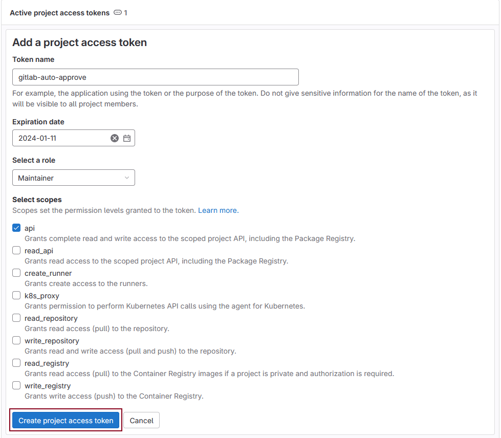
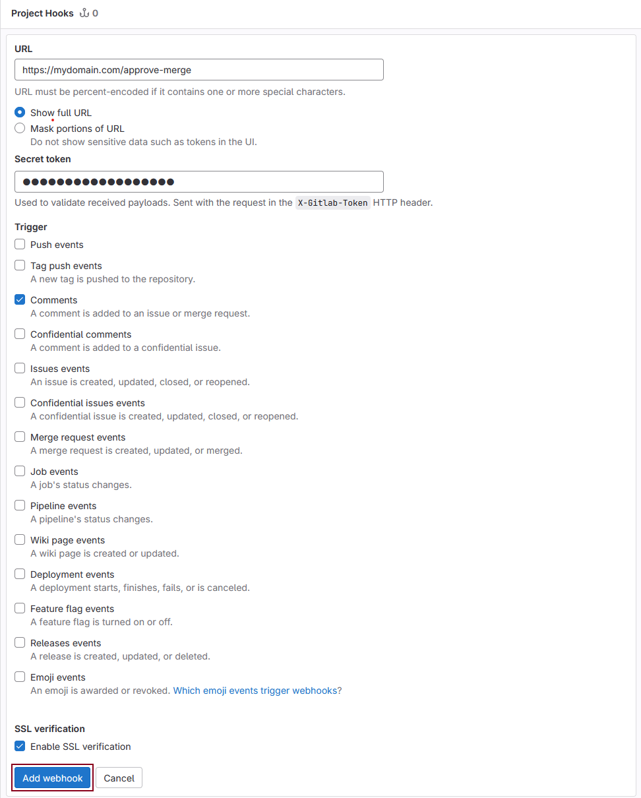

<p align="center">
    
    <p align="center"><i>Credits to <a href="https://giphy.com/gifs/GitHub-ok-thumbs-up-thumb-NytMLKyiaIh6VH9SPm">Github Giphy</a></i></p>
</p>

<br>
<h3 align="center">Gitlab Auto Approve</h3>
<br>

<p align="center">
    <a href="https://github.com/niklasstoffers/gitlab-auto-approve/blob/main/LICENSE"></a>
    <a href="https://hub.docker.com/repository/docker/niklasstoffers/gitlab-auto-approve/general"></a>
    
    <a href="https://github.com/niklasstoffers/gitlab-auto-approve/issues"></a>
    <br>
    
    
    <a href="https://www.codefactor.io/repository/github/niklasstoffers/gitlab-auto-approve"></a>
</p>

**Gitlab Auto Approve** is a [Gitlab](https://about.gitlab.com/) bot for automatically approving merge requests. It's built based on [FastAPI](https://fastapi.tiangolo.com/).

## IMPORTANT

**This bot is still in development. Version v0.1.0 will be out soon**

## Features

This bot currently only supports automatic approval and disapproval of merge requests upon receiving configureable user comments within the gitlab merge request. If you are missing further features please [open a new issue](https://github.com/niklasstoffers/gitlab-auto-approve/issues/new).

## Compatibility

Due to limitations in the Gitlab API approval commands can only be used with a Premium or Ultimate Tier instance. This bot was primarily tested for Gitlab version `v16.7.0`. If you encounter issues with a different Gitlab version please [open a new issue](https://github.com/niklasstoffers/gitlab-auto-approve/).

## Setup

To setup a new instance of this bot you can either clone the repository and run the application on your own using the instructions below or use a prebuilt docker image that can be found [here](https://hub.docker.com/r/niklasstoffers/gitlab-auto-approve).

### Setup using prebuilt image

If you want to use the [prebuilt docker image](https://hub.docker.com/r/niklasstoffers/gitlab-auto-approve) from Docker Hub, please follow the steps below.

1. Pull the image from docker hub with `docker pull niklasstoffers/gitlab-auto-approve:latest`
2. Configure the bot via environment variables as described [here](#configuration)
3. Run the image with `docker`

### Building the image yourself

If you don't want to use the [prebuilt docker image](https://hub.docker.com/r/niklasstoffers/gitlab-auto-approve) from Docker Hub, but instead want to build the image yourself, please follow the steps below.

1. Clone the repository
2. Make sure that you have `docker` and `docker-compose` installed. If you want to use the *Makefile* thats shipped with this repository please also make sure that you have installed `make`.
3. Configure the bot via environment variables as described [here](#configuration)
4. Build and run the image
    * Using `make`:
        ```bash
        make build
        make run
        ```
    * Without `make`:
        ```bash
        docker-compose --env-file .env.docker build
        docker-compose --env-file .env.docker up
        ```

### Run without docker ###

You can also setup a new instance without using *Docker*. To do this you will need to have *Python3* installed on your machine.

1. Clone the repository
2. Configure the bot via the *autoapprove/config.yaml* file as described [here](#configuration)
3. Run the following commands in your terminal
    ```bash
    cd autoapprove
    python3 -m venv .venv
    source .venv/bin/activate
    pip install -r requirements.txt
    python main.py
    ```

## Integrating with Gitlab

To integrate this bot with your gitlab repository you will need Maintainer access to your project.

1. Head over to the projects *Access Token* settings and create a new access token with the *api* scope and necessary role to be able to approve the merge request. This role will depend on your project settings.
<p align="center">
    <br>
    
</p>
2. Open the projects *Webhooks* settings and add a new webhook. 
    1. Specify the url as the url your instance is running under. The endpoint will be `/approve-merge`.
    2. Create a secret token that the bot will use to verify that the HTTP request comes from your webhook.
    3. Add the `comment` trigger
    4. Depending on whether you use SSL and whether your SSL certificate is self-signed, enable or disable the *Enable SSL verification* option.
<p align="center">
    <br>
    <br>
    
</p>
<br>

## Configuration

You can use the following configuration options to configure the bot to your specific needs. The bot accepts both configuration via the *autoapprove/config.yaml* file as well as environment variables. Environment variable configuration will override configuration in the *autoapprove/config.yaml* file.

| Option      | Environment variable | Description |
| ----------- | ----------- | ----------- |
| `gitlab` | - | Section for Gitlab specific configuration |
| `gitlab.host` | `GITLAB__HOST` | Configures the server url of the gitlab server |
| `gitlab.access_token` | `GITLAB__ACCESS_TOKEN` | Access token that needs to be setup for your gitlab repository. This is used in order to make calls to the Gitlab API |
| `gitlab.webhook_token` | `GITLAB__WEBHOOK_TOKEN` | Webhook token that was specified when creating the `comment` trigger webhook |
| `trusted_hosts_only` | `TRUSTED_HOSTS_ONLY` | If enabled will block HTTP requests that do not contain your `gitlab_host` in the HTTP Host header |
| `environment` | `ENVIRONMENT` | Sets the environment the bot will run under. Supports either `DEVELOPMENT` or `PRODUCTION`. Under the `DEVELOPMENT` environment certain features like the Open-API documentation will be available. |
| `ssl` | - | Section for SSL specific configuration options |
| `ssl.enable` | `SSL__ENABLE` | Enables HTTPS. You will need additional configuration for your SSL certificates. See [HTTPS](#https) |
| `ssl.key_file` | `SSL__KEY_FILE` | Path to your SSL private key file |
| `ssl.cert_file` | `SSL__CERT_FILE` | Path to your SSL certificate file |
| `commands` | - | Section for command specific configuration |
| `commands.<type>` | - | Section for command type specific configuration. This configuration options are available to all commands. |
| `commands.<type>.keyword` | `COMMANDS__<TYPE>__KEYWORD` | Keyword that the bot will scan the user comment for. |
| `commands.<type>.ignore_case` | `COMMANDS__<TYPE>__IGNORE_CASE` | If set to `true` the bot won't treate keywords case-sensitive. |
| `commands.<type>.strict_match` | `COMMANDS__<TYPE>__STRICT_MATCH` | If set to `true` the bot will only invoke the command when the user comment **only** contains the keyword. If set to `false` the keyword only needs to be present within the entire comment. |
| `commands.<type>.only_for_members` | `COMMANDS__<TYPE>__ONLY_FOR_MEMBERS` | Comma-separated list of Gitlab usernames. If specified the bot will only invoke the command if the comment author is in the username list. |
| `commands.<type>.requires_role` | `COMMANDS__<TYPE>__REQUIRES_ROLE` | Required role for the command. If specified the bot will only invoke the command if the comment author has the specified role. Can be set to `NO_ACCESS`, `MINIMAL_ACCESS`, `GUEST`, `REPORTER`, `DEVELOPER`, `MAINTAINER` or `OWNER`. |
| `commands.<type>.message` | `COMMANDS__<TYPE>__MESSAGE` | Comment response that the bot will create after invoking the command. If left empty the bot won't send a message at all. |
| `commands.approval` | - | Section for configuration options regarding the approval of merge requests. |
| `commands.disapproval` | - | Section for configuration options regarding the disapproval of merge requests. |
| `commands.merge` | - | Section for configuration options regarding merge of merge requests. |
| `uvicorn.reload` | `UVICORN__RELOAD` | If set to `true` uvicorn will reload the server upon file change. This should be set to `false` in production environments but is a useful setting for development. |
| `logging` | - | Section for configuration options regarding logging |
| `logging.enable` | `LOGGING__ENABLE` | Enables logging within the application. Note that the bot also comes with startup logging which already logs before configuration is loaded. If you want to disable startup logging invoke the application with the `--disable-startup-logs` command line option. |
| `logging.level` | `LOGGING__LEVEL` | Sets the log level to be used. Can be set to `DEBUG`, `INFO`, `WARNING`, `ERROR` or `CRITICAL`. |
| `logging.handlers` | - | Section for configuration options regarding logging handlers. |
| `logging.handlers.console` | - | Section for configuration options regarding console logging handler. |
| `logging.handlers.console.enable` | `LOGGING__HANDLERS__CONSOLE__ENABLE` | If set to `true` the application will log to the console. |
| `logging.handlers.file` | - | Section for configuration options regarding file logging handler. |
| `logging.handlers.file.enable` | `LOGGING__HANDLERS__FILE__ENABLE` | If set to `true` the application will log to a file. |
| `logging.handlers.file.logfile` | `LOGGING__HANDLERS__FILE__LOGFILE` | Path to the logfile. Must be set if file logging is enabled. |

### HTTPS

To use HTTPS with the bot you will need to enable SSL via the configuration options. Furthermore you will also need to supply the SSL certificate and private key to the bot. If you're running the bot with docker, we recommend mounting a volume into the container that contains your SSL certificate and specifying the path accordingly. If you run the bot without docker you can just specify a path on your local filesystem.

<br>

> [!WARNING]   
> We strongly recommend enabling HTTPS as traffic will be unencrypted and publicly visible otherwise. This traffic will include confidential information such as usernames, project names, project/group access tokens and more!